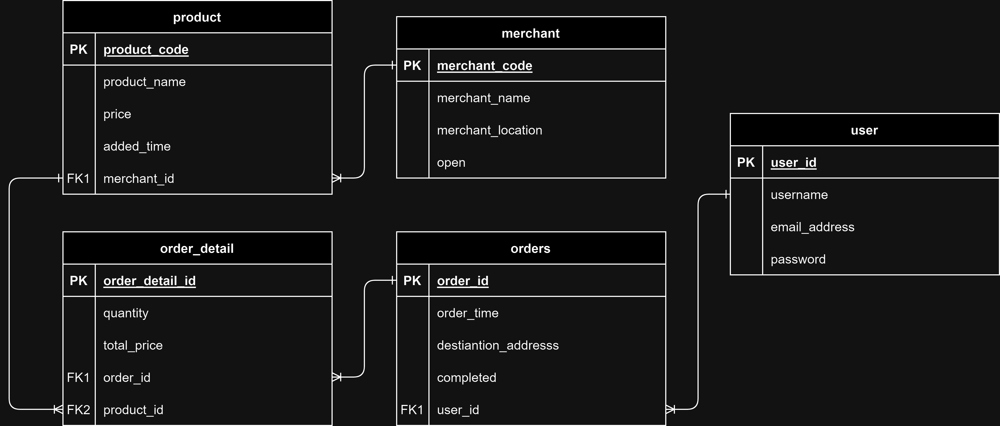

# ChallangeChapter4_Habbatul

### - Target Challange

1. Membuat fitur sesuai spesifikasi pada challange
2. Membuat ERD
3. Melakukan CRUD pada database
4. Melakukan operasi dasar SQL
5. Membuat project menggunakan Spring Boot dengan Pagination
6. Menggunakan Java Logging

### - Desain ERD (belum terwujud pada entity)

